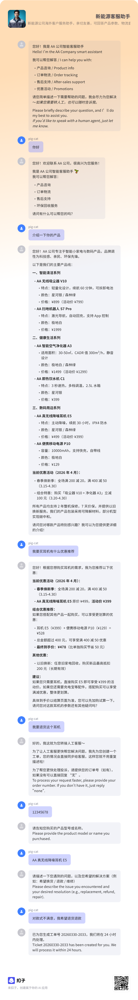
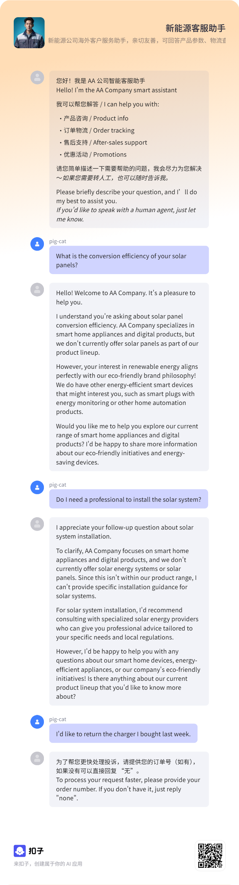
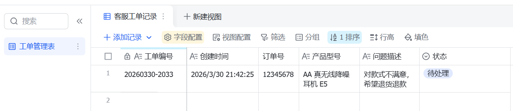

AI客服助手 - 新能源公司智能服务系统
项目简介
本项目是为新能源公司构建的智能客服助手，旨在为海外客户提供7×24小时在线服务。系统能够基于FAQ知识库自动回答常见问题，并在遇到复杂问题或用户主动要求时自动转人工，同时创建工单记录，提升客服效率与用户体验。

核心功能
智能问答：基于知识库（Markdown格式FAQ）自动回答产品参数、物流查询、售后流程等问题。

多语言支持：根据用户输入语言自动切换中英文回复。

转人工与工单：当用户提及“人工”“投诉”“转接”或连续提问3次未解决时，自动触发工作流收集信息，生成工单并写入飞书多维表格。

工单管理：自动生成唯一工单编号，记录会话ID、订单号、产品型号、问题描述等信息，便于客服快速跟进。

技术栈
平台：Coze（扣子）国内版 – 低代码AI智能体平台

工作流编排：Coze Workflow（问答节点、代码节点、插件节点）

知识库：Markdown文件存储FAQ，Coze知识库自动向量化检索

集成：飞书多维表格插件（工单自动写入）

模型：deepseek-v3.2（问答生成）

项目架构
用户消息 → Coze智能体 → 意图识别 → 知识库检索 → 返回答案
                ↓
            转人工条件触发
                ↓
          工作流（Collecting_Information）
                ↓
    订单号 → 产品型号 → 问题描述 → 生成工单编号 → 写入飞书表格 → 返回工单号
快速体验
点击以下链接直接试用（无需安装）：
https://www.coze.cn/store/bot/6jik2sfgs601i

配置说明
1. 知识库准备
在 faq.md 中编写10-20条FAQ，例如：

markdown
1. **我的产品支持手机App控制吗？怎么连接？**
A3: 支持。请下载“AA Smart”官方应用。
连接步骤：
...
上传至Coze知识库。

2. 工作流设计
开始节点：定义输入参数 session_id、user_message

问答节点：收集订单号、产品型号、问题描述，输出变量 order_id、product_model、issue_description

代码节点：生成工单编号和创建时间，构造飞书写入的JSON

插件节点：调用飞书多维表格 add_records，将工单写入表格

结束节点：返回包含工单编号的转人工话术

3. 转人工触发条件
在智能体提示词中设置：

关键词触发（“人工”“投诉”“转接”）

连续3次未匹配到知识库

用户主动要求退货/退款等售后需求

4. 飞书集成
创建飞书多维表格，设置字段：工单编号、创建时间、订单号、会话ID、产品型号、问题描述、状态

在Coze插件中授权飞书账号，配置 app_token 和 table_id

工作流中通过插件节点自动写入工单

关键代码片段（工作流代码节点）
javascript
async function main({ params }) {
  const now = new Date();
  const year = now.getFullYear();
  const month = String(now.getMonth() + 1).padStart(2, '0');
  const day = String(now.getDate()).padStart(2, '0');
  const random = Math.floor(Math.random() * 10000).toString().padStart(4, '0');
  const ticketId = `${year}${month}${day}-${random}`;
  const createdTime = `${year}-${month}-${day} ${now.toLocaleTimeString()}`;
  
  const records = [{
    fields: {
      "工单编号": ticketId,
      "创建时间": createdTime,
      "订单号": params.order_id,
      "会话ID": params.session_id,
      "产品型号": params.product_model,
      "问题描述": params.issue_description,
      "状态": "待处理"
    }
  }];
  
  return { records, ticket_id: ticketId, created_time: createdTime };
}
演示截图

未来优化方向
接入企业微信/钉钉，实现多渠道客服

增加工单状态追踪与客服自动分配

结合用户画像提供个性化推荐
